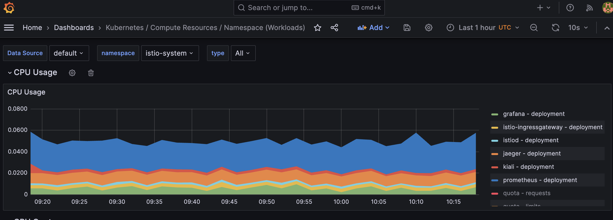

<h3 align="center" style="border-bottom: none">
    ✨ 🔮 OpenIM Deployment On AWS EKS 🔮 ✨  
<h3>

## 🐙 Project Repositories

- [OpenIM Terraform Infrastructure Repo](https://github.com/truongpx396/OpenIM-Terraform-Infrastructure)

- [OpenIM Repo](https://github.com/truongpx396/Open-IM-Server)
- [OpenIM K8S Deployment Repo](https://github.com/truongpx396/OpenIM-K8S-Deployment)
- [OpenIM Mobile App Repo](https://github.com/truongpx396/OpenIM-Flutter)

<h3 align="center" style="border-bottom: none">
    🚢 ✨ Below is the result of the deployment ✨ 🚢  
<h3>

## ☁️ Aws

## 👷‍♂️ Jenkins

## 📦 Docker Hub
https://hub.docker.com/repositories/truongpx396

## 🦑 Argocd
https://argocd.k8s.magiclab396.com/

OpenIm Details 

OpenIm Dependencies

OpenIm Data Viewers

## 🕸️ Istio Kiali

## 🔥 Prometheus

https://prometheus.k8s.magiclab396.com/

 
## 🔍 Grafana

https://grafana.k8s.magiclab396.com/

#### System Overview

#### Argocd

#### Istio

#### Kube prometheus

#### OpenIM Main

#### OpenIM Admin Management

#### OpenIM Dependencies

#### OpenIM Data Viewer

## 📱 Mobile App 

 
 

